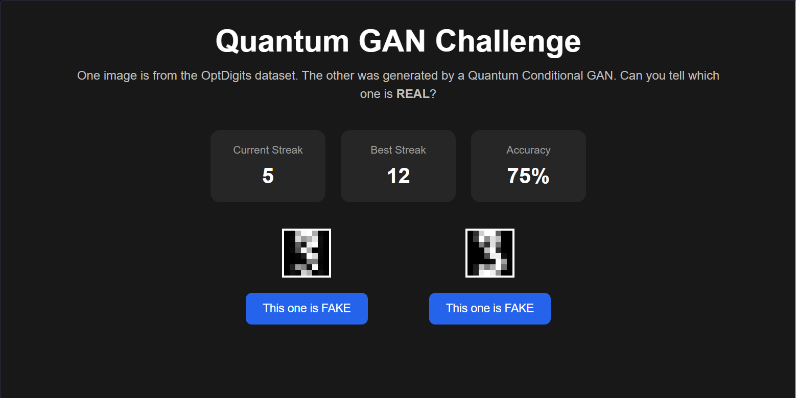

# Conditional Quantum GAN for Handwritten Digit Generation

An implementation of a **Conditional Quantum Generative Adversarial Network (QCGAN)** for handwritten digit synthesis using **PennyLane** and **PyTorch**. The generator combines classical neural networks with parameterized quantum circuits to generate class-conditioned handwritten digits from the OptDigits dataset.

The repository also includes an interactive Flask web application that demonstrates the quality of the trained generator by asking users to distinguish between real dataset samples and QCGAN-generated images.

---

## Overview

This project explores the use of **hybrid quantum-classical generative models** for image synthesis.

Unlike conventional GANs, the generator incorporates parameterized quantum circuits as learnable quantum feature generators while retaining classical neural networks for conditioning and latent preprocessing.

Each generated image is conditioned on a specified digit label (0–9), enabling controlled image generation.

---
## Interactive Demo

The repository includes a lightweight Flask web application that serves as an interactive evaluation interface for the trained Conditional Quantum GAN. Each round presents a real handwritten digit alongside a QCGAN-generated digit conditioned on the same class label. Players attempt to identify the real sample, providing an intuitive qualitative assessment of the generator's performance.

<p align="center">
  
</p>

---
## Model Architecture

The generator consists of three main stages:

### Classical Conditioning

* Learnable label embeddings
* Latent conditioning
* Classical stem network
* Classical bias network for quantum circuit conditioning

### Quantum Generator

The conditioned latent representation is divided into four independent quantum patches.

Each patch consists of:

* 5 qubits
* 6 variational layers
* Parameterized RY rotations
* CZ entangling gates

Each quantum circuit outputs a probability distribution which forms one portion of the generated image.

The four patches are concatenated to produce a complete **8×8 handwritten digit**.

### Discriminator

The discriminator is a classical feed-forward neural network conditioned using label embeddings.

It receives:

* Flattened 8×8 image
* Embedded class label

and predicts whether the sample is real or generated.

---

## Dataset

The model is trained on the **OptDigits** handwritten digit dataset.

Characteristics:

* 8×8 grayscale images
* 10 digit classes
* Pixel values normalized to [0,1]

---

## Interactive Demo

The included Flask application serves as an evaluation tool for the trained generator.

For every round:

1. A real handwritten digit is sampled from the OptDigits dataset.
2. A new digit is generated by the QCGAN using the **same class label**.
3. The images are randomly shuffled.
4. The user attempts to identify the real image.

The application tracks:

* Current streak
* Best streak
* Overall accuracy

This provides an intuitive way to assess how convincingly the quantum generator reproduces handwritten digits.

---

## Repository Structure

```text
.
├── app.py                  # Flask application
├── generator.py            # Hybrid quantum generator
├── generator.pth           # Trained generator weights
├── optdigits.tra           # OptDigits dataset
├── templates/
│   └── index.html
├── static/
│   ├── style.css
│   └── script.js
└── requirements.txt
```

---

## Installation

Clone the repository:

```bash
git clone <repository-url>
cd <repository-name>
```

Create a virtual environment:

```bash
python -m venv venv
```

Activate it:

### Windows

```bash
venv\Scripts\activate
```

### Linux / macOS

```bash
source venv/bin/activate
```

Install dependencies:

```bash
pip install -r requirements.txt
```

---

## Running the Application

Start the Flask server:

```bash
python app.py
```

Then open:

```
http://127.0.0.1:5000
```

in your browser.

---

## Technologies

* Python
* PyTorch
* PennyLane
* PennyLane Lightning
* Flask
* NumPy
* Pandas
* Pillow

---

## Future Work

Possible extensions include:

* Larger image resolutions using additional quantum patches
* Evaluation using quantitative metrics such as FID or Inception Score
* Comparison with fully classical conditional GANs
* Deployment on quantum hardware or hardware-aware simulators
* Alternative quantum circuit architectures and ansätze

---

## License

This project is intended for research and educational purposes.
